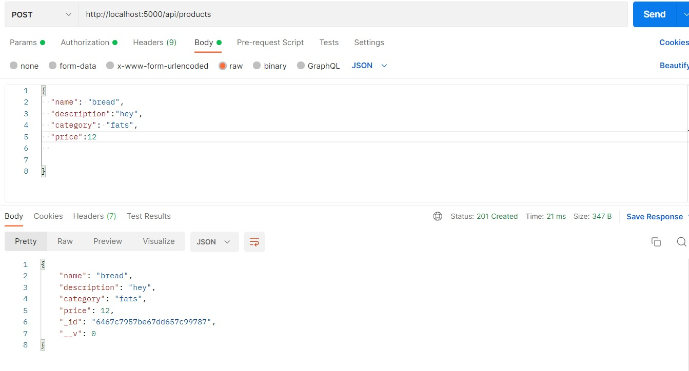

# Fictional store API

This is a RESTful API for a fictional online store that sells electronic products. It allows users to perform various actions such as creating, reading, updating, and deleting products, searching for products, adding products to a shopping cart, placing orders, and registering and authenticating users.

## Technologies Used

Node.js  
Express.js  
MongoDB  
JSON Web Tokens (JWT)

## Getting Started

To get started with the API, follow the instructions below.

## To get started with the API, follow the instructions below.

Make sure you have the following software installed on your local machine:

Node.js (Download and install from https://nodejs.org) 
MongoDB (Download and install from https://www.mongodb.com)

## Installation and Settings

1.Clone the repository to your local machine:git clone url 
  
2.Set up the project: 
  Create a new directory for your project and navigate to it in the terminal. Then, run the following commands: 

  a.Initialize a new Node.js project 
  npm init -y  

  b.Install required dependencies 
  npm install express mongoose bcrypt jsonwebtoken joi dotenv  
3. Set up environment variables:

Create a .env file in the root directory of the project.

Add the following environment variables to the .env file: 
MONGODB_URI=your-mongodb-url  
JWT_SECRET=your-jwt-secret
  
## Running the Server
  node app.js
  
## API Endpoints
  
GET /api/products - Get all products with pagination support. You can use query parameters page and limit to specify the page number and number of items per page.

POST /api/products - Create a new product. Requires authentication.

GET /api/products/:id - Get a product by ID.

PUT /api/products/:id - Update a product by ID. Requires authentication.

DELETE /api/products/:id - Delete a product by ID. Requires authentication.

GET /api/products/search - Search for products by name, description, and category. You can use the query parameter query to specify the search term.

POST /api/users/register - Register a new user.

POST /api/users/login - Log in a user and receive a JWT token.

POST /api/orders - Place an order by adding products to the shopping cart. Requires authentication.
  
endpoints that require authentication (POST /api/products, PUT /api/products/:id, and POST /api/orders) require a JWT token to be sent in the Authorization header with the format Bearer <token>.
  
## Testing the API
  
Here's an example of using Postman to make a request to the API: 

for eg: this is test of API of adding a new  item  

